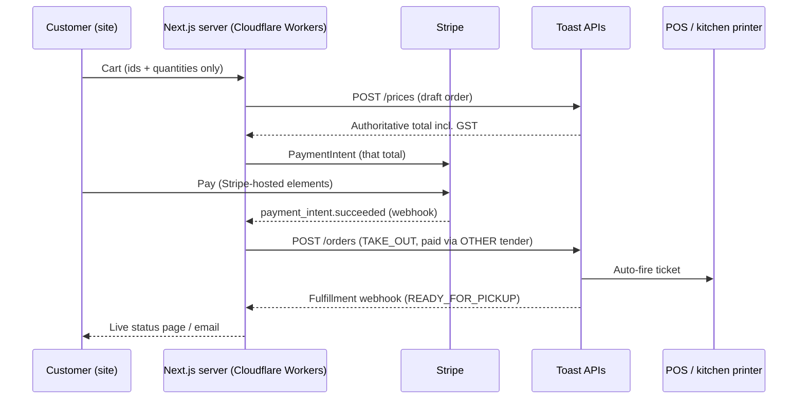

# Meros Online Ordering: Plan

**Date:** 2026-07-23 · **Owner:** Thomas · **Target:** live for opening weekend (**Aug 7–10, 2026**)
**Commitment:** part of the original agreement with Kim: aim for opening weekend, but the deadline is soft; slipping past open is acceptable. Plan still treats opening as the target.

---

## 1. Goal & constraints

- Customers order Meros bowls (signature + custom builds) online for pickup, pay, and staff reliably see the order in time to make it.
- Store runs **Toast** for in-store payments (assumed, ~90% confident; **confirm first, everything downstream depends on it**).
- **Code lives in this repo**: Track A is a CTA link; Track B is server actions/route handlers beside the cart/catalog code they reuse. No separate repo unless the venture productizes it later.
- **Deployment:** site runs on **Cloudflare** Workers (OpenNext adapter) on `merosyogurt.com` (GoDaddy-registered, confirm exact spelling; DNS → Cloudflare). Hosting cost is a rounding error at this traffic (free tier / $5 Workers Paid); replatform before or after opening weekend, not during it. Track A doesn't depend on it.
- ~2-week runway. Store staff currently take orders fully verbally (named bowl, or Subway-style custom build); there is **no existing ticket/expo habit**: the staff-side flow must be designed, not just wired.
- Access to credentials/admin is easy (Kim/Paul in person), but **Toast's own process timelines are not under our control**.

## 2. Current state (website)

The customer-facing half already exists:

| Piece | Where | Status |
|---|---|---|
| Signature bowls + custom bowl builder | `app/order/`, `store/bowlBuilderStore.ts`, `lib/menu/menu.json` | Built |
| Cart (Zustand, edit lines) | `store/cartStore.ts`, `components/cart/*` | Built |
| Server-side re-pricing (client never trusted) | `app/actions/checkout.ts` (`priceLine`, `resolveItems`) | Built |
| Checkout form (name/email/phone) | `app/checkout/page.tsx` → `submitCheckout` | Built |
| **Payment** | `submitCheckout` TODO(payment) | **Missing** |
| **Order delivery to store** | `submitCheckout` ends at `console.log` | **Missing** |
| Tax calculation | none | **Missing** (BC: 5% GST on prepared food; no PST on food) |
| Legal pages | `app/privacy`, `app/terms` | Built; have `TODO(stripe)` markers to update when a processor lands |

Menu source of truth today is **website code** (`lib/menu/menu.json`). Toast will have its own menu config; keeping the two consistent is a standing requirement in every option below.

## 3. What the research found (2026-07-23)

### Path 1: Toast Online Ordering (first-party, hosted)

- For a restaurant already on Toast POS, enabling it is **self-serve in Toast Web** once the module is on the subscription, with no documented Toast-side approval gate. The one external dependency: confirming the module is on Meros' contract (Customer Care check; ~$75 USD/mo per secondary sources; commission-free, card-not-present processing ~3.4–3.5% + $0.15). [Getting Started](https://support.toasttab.com/en/article/Getting-Started-Online-Ordering) · [Config guide](https://pos.toasttab.com/configuring-your-online-ordering-suite)
- Setup steps: flag menu/items/modifiers visible to the Online Ordering channel → hours & pickup settings → payment/tip config → designate exactly **one always-on POS terminal as the auto-fire device** → test order.
- **Staff experience:** orders land in the POS **Orders Hub**; configurable **auto-fire straight to kitchen printer/KDS** or a Needs-Approval queue with rules. Quote/prep-time strategies (manual, capacity-based, SmartQuote) and staff throttling (snooze/delay/off) built in. Caveats: no audible new-order alert documented; online orders bypass Offline Mode (if the auto-fire terminal drops, tickets stop). [Orders Hub](https://support.toasttab.com/en/article/Orders-Hub-FAQ) · [Auto-firing](https://support.toasttab.com/en/article/How-do-I-ensure-scheduled-orders-and-online-orders-fire-automatically-to-the-kitchen-1492811100407)
- **Branding:** template-level only (logo, colors, font, banner) on a toasttab.com URL; custom domain (e.g. `order.merosyaletown.com`) appears gated behind the **Online Ordering Pro** tier. Checkout always stays on Toast's hosted flow; we link or embed from our site. Menu syncs live from POS config, 86'ing is real-time.
- Custom bowls are expressible as a menu item with modifier groups (base choice, toppings, finish, enhancers), which works but gives a generic UI compared to our builder.

### Path 2: Custom build on Toast APIs (website-native)

- **Access tiers are the governing fact.** *Standard API access* (self-serve for the restaurant) is **read-only: cannot create orders and has no sandbox**. Order injection requires **Custom Integration** access: requested through Meros' **Toast account rep**, no published timeline or price (anecdotally 1–3 weeks; unconfirmed). The heavyweight Partner program (certification, alpha/beta) is for ISVs serving many restaurants, not needed for a single-restaurant build. [Integration types](https://doc.toasttab.com/doc/devguide/apiIntegrationTypes.html) · [Custom integration](https://doc.toasttab.com/doc/devguide/apiCustomIntegrationOverview.html)
- With write access, the core flow is fully documented and buildable:
  - `POST /prices` with the draft order → Toast returns the **authoritative total incl. tax** (the only supported way to compute a chargeable amount; never compute tax ourselves), then `POST /orders`. [Order prices](https://doc.toasttab.com/doc/devguide/apiOrderPrices.html) · [Creating orders](https://doc.toasttab.com/doc/devguide/apiCreatingOrders.html)
  - `TAKE_OUT` dining option (requires guest name/phone/email, we already collect these), scheduled orders via `promisedDate`, full modifier support (≥3 levels nesting).
  - API orders auto-fire to kitchen if the restaurant's auto-fire device + dining-option→prep-station mapping is configured.
  - **Guest Order Fulfillment Status webhook** (`IN_PREPARATION` / `READY_FOR_PICKUP` / `CLOSED` / `VOIDED`) → we can show live order status on the site. [Webhook](https://doc.toasttab.com/doc/devguide/apiGuestOrderFulfillmentStatusWebhook.html)
  - Menus API v3 returns the resolved menu incl. prices; checklist requires re-sync polling every 1–5 min (or stock webhook) for 86'd items.
- **Payment is the hard part.** Toast exposes **no hosted checkout to integrations**. Options:
  1. **Native `CREDIT`**: we'd collect raw card data and encrypt with a Toast-issued RSA key; **full PCI-DSS liability on us. Rejected.** Never roll our own card handling.
  2. **Stripe on our site + submit the Toast order paid via an `OTHER` alternative-payment-type** (a tender Kim/Paul pre-configure in Toast Web, e.g. "Website prepaid"). Documented mechanism (how Grubhub etc. appear in Toast). Policy nuance unconfirmed; validate with Toast integration support. **Recommended.**
  3. **Pay at pickup** (submit order with check `paymentStatus: OPEN`): plausible per the order model but **not explicitly confirmed for API-submitted orders**: verify in sandbox. Also weak operationally (no-show risk).
- Sandbox exists (simulated payments) but is **gated behind Custom Integration approval** and only up 9am–6pm ET, another reason the access request is the critical path.

### Canada caveat

All researched docs/pricing are US-centric. Toast operates in Canada, but the Toast Local consumer app is US-only and CAD pricing/processing rates may differ. Add to the verify-with-Toast list.

## 4. Recommendation: two tracks, started in parallel on day 1

> **Track A ships the commitment. Track B is the product we actually want.** Do not bet the opening date on Toast's Custom Integration approval timeline; it is undocumented and outside our control.

### Track A: Toast Online Ordering live for opening day (week 1)

Fast, reliable, staff-native. The website's "Order Now" CTA points at the Toast-hosted ordering page (the default toasttab.com URL is fine to launch with; `order.merosyogurt.com` is optional vanity gated behind the Pro tier, skip unless cheap). Orders auto-fire into the POS/printer with Toast's own quote-time + throttling, no custom staff tooling needed for launch, which matters given the team has no ticket habit yet.

Cost of this trade: checkout leaves our beautifully built cart/bowl-builder for a generic Toast page, ~$75/mo module fee, template-level branding. Acceptable for launch; Track B removes it.

**Checklist (most of this is a store visit with Paul + one Toast support call):**
1. Confirm Toast is the POS; get admin access ("Manage Integrations" + menu permissions).
2. Confirm the Online Ordering module is on the subscription (Customer Care). **This is the long pole of Track A; do it first.** Ask about Pro tier/custom domain + CAD pricing while on the call.
3. Build the online menu in Toast Web: signature bowls + "Custom Bowl" item with modifier groups mirroring `menu.json` (base / fruits & berries / nuts & seeds / finish / enhancers, with the same surcharge prices).
4. Pickup settings: hours, quote-time strategy (start Manual, e.g. 10–15 min), auto-fire device designated (the counter terminal), decide printer vs. screen for the make-line. **Buy a kitchen ticket printer if they don't have one; a bowl line needs a durable artifact, not a POS screen glance.**
5. Train staff: Orders Hub, approval vs auto-fire (recommend auto-fire + throttle permissions for Paul), snooze/delay, marking Order Ready.
6. Website: swap checkout CTA → Toast page; keep our `/order` menu as the showcase; place a test order end-to-end and watch it hit the make-line.

### Track B: Website-native ordering on the Orders API (phase 2, target ~2–6 weeks post-access)

Architecture once Custom Integration access is granted:

Key build items:
- **Access request to the Toast account rep now** (scopes from the ordering checklist: `orders.orders:write`, `config:read`, `menus.channel:read`, `restaurants:read`, `stock:read`, `digital_schedule:read`, `packaging:read`; skip `credit_cards.authorization:write` since we're not touching cards). Get sandbox credentials in the same conversation.
- **Menu mapping:** extend `menu.json` items with Toast GUIDs (item + modifier group + modifier); signature additions and removals (`lib/menu/signatureMods.ts`) are already ingredient ids, so they map onto Toast modifier groups with the same GUID table, no separate mapping; nightly/deploy-time validation job diffs our catalog against Menus API v3; poll stock endpoint (or webhook) for 86'd items to disable them in the builder.
- **Payment:** Stripe (PaymentIntents, server-confirmed, amount always from `/prices`, never client input); Toast order submitted only on `payment_intent.succeeded` webhook, idempotency-keyed; refund path = Stripe refund + order void. Update `app/privacy` + `app/terms` per the existing `TODO(stripe)` markers.
- **Resilience:** if `POST /orders` fails after successful charge → queue + retry, alert (this is the one state that needs ops attention: money taken, no ticket). Store orders in our own DB (Postgres/Neon) as the audit trail regardless of Toast.
- **Ops parity:** the auto-fire/prep-station/dining-option mapping done in Track A is reused; staff experience is identical tickets regardless of which channel the order came from.
- Confirm with Toast support: `OTHER`-tender policy for externally-captured payments, and whether unpaid/`OPEN` API orders are allowed (nice-to-have fallback).

## 5. Risks

| Risk | Impact | Mitigation |
|---|---|---|
| Toast isn't actually the POS | Whole plan resets | Confirm with Paul **today** |
| Online Ordering module not on contract / sales cycle needed | Track A slips | Call Customer Care in week 1, day 1–2 |
| Custom Integration approval slow/denied | Track B slips | Track A carries opening; request access day 1 anyway |
| No audible order alert; staff miss orders on a busy line | Bad first-week pickups | Kitchen ticket printer + auto-fire; assign an "orders" owner per shift; test during a rush |
| Auto-fire terminal offline → silent order loss | Angry customers | Always-on terminal on wired power/net; opening-week habit: check Orders Hub every ~10 min |
| Stripe-charged, Toast-order-failed (Track B) | Money taken, no bowl | Retry queue + alerting + own-DB order record |
| Menu drift (site vs Toast) | Wrong prices/tax | Track A: Toast is source of truth. Track B: GUID mapping + automated diff |

## 6. Information needed (Kim / Paul / Toast)

1. Confirm Toast + which products are on the account (POS terminals? KDS? printer? Online Ordering module?).
2. Exact opening date within the Aug 7–10 weekend.
3. Toast admin login for Thomas + account rep contact (for the Custom Integration request).
4. Pickup policy decisions: hours, quote time, throttle authority, who owns online orders per shift.
5. Custom-domain preference (`order.merosyogurt.com`) → Pro tier question (optional).
6. CAD pricing for the module + card-not-present rate.

## 7. Two-week timeline (Track A)

- **Day 1–2:** Confirm POS; Customer Care call (module, tier, CAD pricing); request Custom Integration access (Track B clock starts); get admin access.
- **Day 3–5:** Build online menu in Toast Web (mirror `menu.json`); pickup/hours/quote-time config; auto-fire device + printer sorted.
- **Day 6–8:** Website CTA integration; end-to-end test orders on-site; fix menu/modifier gaps.
- **Day 9–10:** Staff training with Paul; rush-hour dry run; throttling drill.
- **Buffer (~4 days)** before open. Track B proceeds in background as access lands.

---

*Research: two-agent web sweep 2026-07-23 (Toast first-party product; Toast developer APIs). Key unconfirmed items are flagged inline; primary sources are doc.toasttab.com / support.toasttab.com links above.*

---

## 8. Safe submit path (built 2026-08-30, branch `online-ordering`)

Foundation for Track B, no Toast write anywhere. What landed:

- **Durable idempotency + order record in one table**: `migrations/0001_orders.sql`, D1 binding `ORDERS_DB` (`wrangler.jsonc`). The claim is the INSERT (`ON CONFLICT DO NOTHING` on the idempotency key), so a claim and an order row cannot diverge. `lib/checkout/orderStore.ts`.
- **Fail closed**: if D1 cannot answer, the claim throws and the customer gets the retry message. No dedupe guarantee, no accepted order.
- **Runtime kill switch**: `ORDERING_DISABLED=true` on the Worker refuses orders per request, no rebuild. Stacks under the build-time `CHECKOUT_ENABLED` gate. `lib/checkout/runtime.ts`.
- **Fallback**: without the binding (tests, pre-provision) behaviour is exactly the old per-isolate `MemoryOrderDedupe`.

Row lifecycle: `claimed` → `received` today; `paid` / `sent_to_pos` / `failed` reserved for Stripe and Toast. The row is the store's own audit trail regardless of what Toast later says (the "charged but no ticket" reconciliation reads it).

**Before merge (one-time, in the merosyogurt account):** `wrangler d1 create meros-orders`, paste the `database_id` into `wrangler.jsonc`, `wrangler d1 migrations apply meros-orders --remote`. Local dev: `npx wrangler d1 migrations apply meros-orders --local` once (already applied on this machine).

**Why the website reads Toast (when read credentials are wired in):** not to validate its own orders (that is the idempotency store above). Reads are for: menu GUID mapping + price-drift diff (Menus API), 86'd-item stock to disable builder options, config read for the `TAKE_OUT` dining option and `OTHER` tender GUIDs and store hours, and orders read for post-submit reconciliation (confirm a timed-out `POST /orders` landed before retrying, and the cron that compares this table against Toast). "Right device" is not an API concern: ticket routing is store-side auto-fire/prep-station config. `POST /prices` (tax authority) is write-tier, so it waits on the Custom Integration grant.
